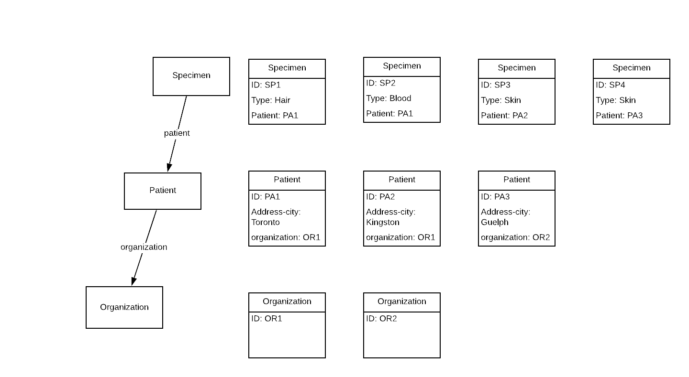

# FHIR Search: References 

# Chain, _has, _include & _revinclude

## Overview

Often times you’ll come across a scenario where you want to fetch not only one Resource, but Resources related to the core resource you’re working with. With FHIR, it’s possible to collect multiple resources in one call, potentially saving computational time. In this lesson, we’ll be going over the basics of chaining, “_has”, “_include” & “_revinclude”. We’ll start by describing how to use these for single relationships, and then describe how they work with nested relationships.

For this topic, we will work with Specimen, Patient, and Organization resources. When reading through the query examples, refer to this diagram



## Single-Reference Queries

We will start by focusing on a single arrow in the diagram above: the link from a Patient to its Organization via the Patients “organization” parameter.


## Chain

A chain allows you to reduce the amount of search operations needed by “chaining” reference parameters in your API call, by appending a “.’ to a field, the name of a search parameter defined for the target resource. Consider the following query:


```url
/Patient?organization._id=OR1
```


In this query, we’re trying to capture all Patients who belong to Organization “OR1”. Taking a look at our diagram from earlier, we see that Patients PA1 and PA2 both belong to the Organization OR1 and so the expected results are:

The expected results are: PA1, PA2.


## Reverse Chain (_has)

“_has” works similarly to chaining, but in reverse - that is, selecting resources based on the properties of resources that refer to them. If you look at our diagram, you can see the flow that describes how one resource relates to another. With “_has”, take that same flow and reverse it. 


```url
/Organization?_has:Patient:organization:address-city=Kingston
```


In this query, we are looking for all Organizations who have patients that live in Kingston. Note that we’re not concerned with the Patient resource in its entirety, we’re only concerned with the address-city part of the Patient resource.

The expected results are: OR1 \
 \


Include (_include)

So far we’ve been looking at chaining queries to help slim down what results we’re trying to capture. With include, we’re not only capturing a particular resource type in our response, but also including resources related to it. This is particularly useful when you’re trying to capture multiple results without querying the server multiple times. Let’s look at the following query


```url
/Patient?_id=PA1&_include=Patient:organization
```


In this query, we want to return a Patient with an ID of PA1, and include all Organization resources it refers to.

The expected results are: PA1, OR1


## Reverse Include (_revinclude)

_revinclude is to _include what _has is to chaining.  Namely it does the same thing but in reverse.


```url
/Organization?_id=OR1&_revinclude=Patient:organization
```


Here, we are requesting Organization OR1 along with all Patients that reference OR1 as their “organization”. Note that Organizations don’t point to Patients, but Patients point to Organizations and that is why we need to use _revinclude instead of _include here.

The expected results are: OR1, PA1, PA2


## Nested Queries

We will now expand our queries two levels deep, bringing Specimen into the picture.  We are now querying across two relationships: a Specimen’s Patient via the “patient” parameter, as well at the Patient’s Organization via it’s “organization” parameter.  We’ll follow the same order as above.


## Nested Chain


```url
/Specimen?patient.organization._id=OR1
```


In this query, we’re trying to capture all Specimens from Patients who belong to Organization “OR1”.

The expected results are: SP1,SP2,SP3


## Nested Reverse Chain (_has)

_has parameters require more information than chain parameters since you also need to know the resource type as well as the parameter that’s pointing to the resource you start with.


```url
/Organization?_has:Patient:organization:_has:Specimen:patient:type=blood
```


In this query, we are looking for all Organizations who have patients for which we have blood samples.  With _has queries, you can start at the end and work your way backwards.  In this case, we search for all specimens with type “blood” and then follow the “patient” of that specimen to go one level up.  In this case, only one of our specimens, SP2, is a blood sample.  Its patient is PA1.  This patient now points us directly to its organization OR1 and that is our result.

The expected results are: OR1 \
 \


## Nested _include

You can also _include resources that are more than one reference away from your start resource:


```url
/Specimen?_id=SP1&_include=Specimen:patient&_include:iterate=Patient:organization
```


Here, we request Specimen SP1 and ask to include its Patient as well as that Patient’s Organization.  Note the “:iterate” after the second include.  This means also look inside other _included resources for the thing I’m asking for.  For DSTU3, :recurse is used instead of :iterate.

The expected results are: SP1, PA1, OR1


## Reverse Include (_revinclude)

Similarly _revinclude can also include resources more than one away from your starting point:


```url
/Organization?_id=OR1
&_revinclude=Patient:organization
&_revinclude:iterate=Specimen:patient
```


Here, we are requesting Organization OR1 along with all Patients that reference OR1 as their “organization”.  And we also ask for all Specimens that reference patients picked up by the first _revinclude.

The expected results are: OR1, PA1, PA2, SP1, SP2, SP3


## 


## Exercise

Find all Specimens whose Patients have a managingOrganization of OR1 


```url
'/Specimen?patient.organization._id=OR1'
```


Expected response: PA1, PA2

Find all Organizations who are referenced by a Patient that are referenced by a Specimen of type blood


```
'/Organization?_has:Patient:organization:_has:Specimen:patient:type=blood'
```


Expected response: OR1

Find a Specimen with ID SP1, and include all Patients & the Organizations they reference. Note that you may need to use recurse (iterate) to solve this problem


```url
'/Specimen?_id=SP1&_include=Specimen:patient&_include:iterate=Patient:organization'
```


Expected response: SP1, PA1, OR1

Find an Organization with ID OR1, and include all Patients 

DSTU3


```url
'/Organization?_id=OR1_revinclude=Patient:organization&_revinclude:recurse=Speciment:patient'
```


R4


```url
'/Organization?_id=OR1_revinclude=Patient:organization&_revinclude:iterate=Speciment:patient'
```


Expected response: OR1, PA1, PA2, SP1, SP2, SP3
